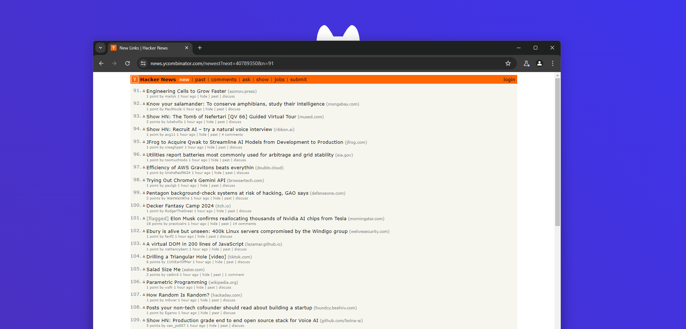
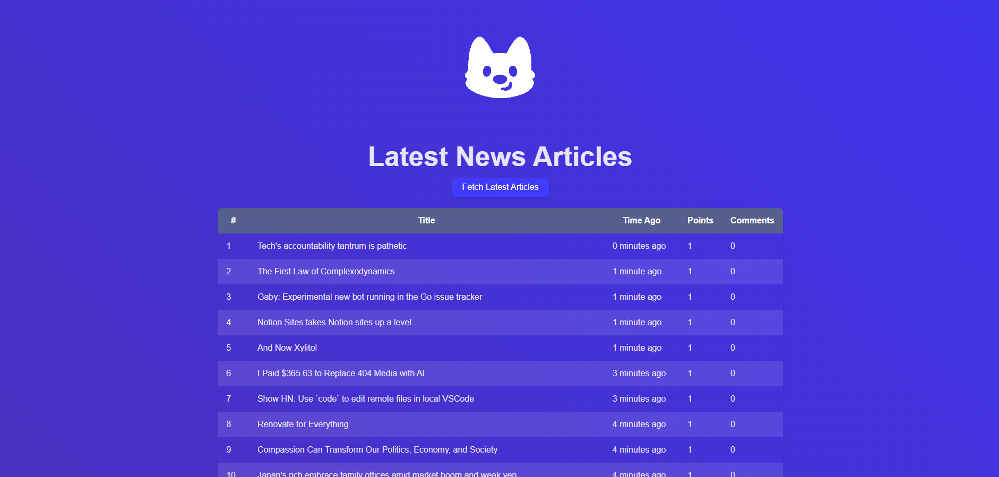

# Automated News Dashboard
This project is a full-stack web application built using React, Vite, Node.js, Express, and Playwright. It features a simple dashboard that fetches and displays articles from Hacker News, using a Playwright script to update the data.

## Features
- **React**: For building the user interface.
- **Vite**: For fast build times and development server.
- **Node.js**: For running JavaScript outside the browser.
- **Express**: For setting up a RESTful API to interact with the server.
- **Playwright**: For web scraping and fetching the latest articles.
- **Continuous Integration (CI)**: Ensuring code quality and functionality with automated testing.

# Notes for learning API's, Server/Client Side

APIs (Application Programming Interfaces) are interfaces that allow different software applications to communicate with each other. They define a set of rules and protocols that enable data exchange between systems.
Types of APIs:

RESTful APIs: These are APIs that follow the principles of Representational State Transfer (REST) and use HTTP requests to perform CRUD (Create, Read, Update, Delete) operations on resources.
Using APIs in Web Development:

Controllers: A controller in web development handles incoming requests, processes the necessary data, and sends back the appropriate responses based on its corresponding API endpoint. It acts as a bridge between the user interface and the backend logic of an application.

Client-Side Requests: Tools like Fetch API in JavaScript (for web browsers) or OkHttp in Java (for Android apps) are used to make HTTP requests from client-side applications to server-side APIs.

Server-Side Handling: APIs created using frameworks like Express (Node.js) or Spring Boot (Java) on the server side receive these requests, process them, and send back the appropriate responses.

RESTful API Creation: Express.js (for Node.js) and Spring Boot (for Java) are commonly used to create RESTful APIs that handle client requests and interact with databases or external services as needed.

The four most common HTTP methods used in REST API development are:

GET: Used to fetch data from a server. For example, retrieving a user's profile information or fetching a list of products from an online store.

POST: Used to send data to a server to create or update a resource. For example, submitting a form to create a new user account or adding an item to a shopping cart.

PUT: Used to update a resource on the server. It replaces the entire resource with the new data sent in the request. For example, updating a user's profile information or replacing an existing file.

DELETE: Used to delete a resource on the server. For example, removing a user account or deleting a specific item from a database.